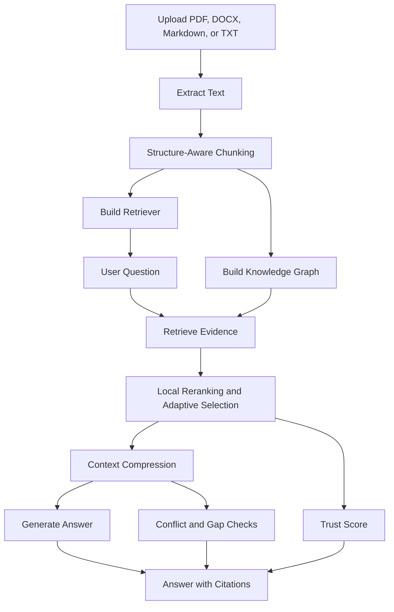

# TrustDoc AI

[](https://www.python.org/)
[](https://streamlit.io/)
[](LICENSE)

TrustDoc AI is a trust-aware RAG chatbot for real-world documents. Users can upload PDFs, Word documents, Markdown, or text files, ask questions, and receive answers with source citations, confidence scoring, knowledge-gap detection, conflict warnings, and document health diagnostics.

> Built as an open-source portfolio project to demonstrate practical RAG engineering beyond a basic document chatbot.

## Why This Project Stands Out

Most portfolio RAG demos stop at "upload PDF, ask a question." TrustDoc AI adds product-grade features that make the assistant safer and more useful:

- Trust score for every answer
- "I do not know" refusal when the evidence is weak
- Source citations with relevance scores
- Query rewriting for vague questions before retrieval
- Local hybrid reranking and adaptive evidence selection before generation
- Adaptive context compression to reduce LLM prompt size
- Optional Graph-Enhanced RAG for relationship-aware retrieval
- LLM-based conflict detection for possibly inconsistent document claims
- Knowledge-gap detection
- Document health report after ingestion
- Content-aware suggested questions based on uploaded documents
- Compare-documents mode
- Multiple answer modes such as action items, email draft, and study notes
- Important-fact highlighting in answers

## Real-Life Use Cases

- Students can query lecture notes or course handbooks.
- Employees can ask questions about HR policies.
- Customers can understand product manuals or refund policies.
- Small businesses can inspect contracts and policy documents.
- Job seekers can compare job descriptions, resumes, and interview notes.

## Architecture

```text
Documents
  -> Text extraction
  -> Structure-aware recursive chunking
  -> Lightweight knowledge graph
  -> Local TF-IDF, Google Gemini embeddings, or OpenAI embeddings
  -> Vector or graph-enhanced retrieval
  -> Local reranking and adaptive context selection
  -> Context compression for API prompts
  -> Answer generation
  -> Trust scoring, gaps, conflicts, citations
```



## Tech Stack

- Python
- Streamlit
- Pure-Python local TF-IDF retriever
- Lightweight in-memory knowledge graph
- Optional Google Gemini embeddings
- Optional OpenAI embeddings and chat generation
- pypdf for PDF text extraction
- python-docx for Word document extraction
- python-dotenv for configuration

The app runs without an API key by using a local TF-IDF retriever and extractive answers. Add a Google AI Studio key to use Gemini embeddings for semantic retrieval, or add an OpenAI key to use OpenAI embeddings and generated responses.

## Chunking Strategy

TrustDoc AI uses structure-aware recursive chunking instead of only fixed-length windows:

- Split by headings and section-like titles first
- Fall back to paragraphs for long sections
- Fall back to sentence groups when paragraphs are too large
- Use fixed character splitting only as a final safety net
- Preserve source/page citations for every chunk

This keeps sections like refund rules, eligibility rules, and process steps together, which usually improves retrieval quality.

## Graph-Enhanced RAG

TrustDoc AI can run in two retrieval modes:

- **Vector RAG:** retrieves the most similar chunks directly.
- **Graph-Enhanced RAG:** retrieves similar chunks, then expands evidence using a lightweight graph of shared entities, headings, concepts, and co-occurring topics.

The graph layer helps with relationship-style questions such as dependencies, exceptions, roles, connected topics, and cross-section comparisons. It is intentionally optional because direct vector retrieval is still faster and better for simple fact lookup.

## Local Reranking and Adaptive Context

TrustDoc AI does not blindly send a fixed number of chunks to the answer model. It first retrieves a wider candidate pool, adds nearby chunks as possible supporting context, then reranks locally with a hybrid score:

```text
final score = semantic/vector similarity + BM25 lexical relevance + document-structure signals
```

The final evidence window is selected adaptively. The app stops adding chunks when relevance drops sharply, when chunks fall below a minimum support threshold, or when the context budget is reached. This keeps API calls focused on the strongest evidence instead of padding the prompt with weak matches.

## Context Compression

For specific questions, TrustDoc AI compresses selected chunks before sending them to Gemini or OpenAI. It keeps the citation, relevant heading, BM25-matched sentences, and nearby condition or exception sentences.

Compression is skipped for broad summary and comparison questions where the surrounding context matters more. The app still shows the original retrieved chunks in the citation panel, while the API prompt receives a smaller evidence version to reduce input tokens.

## Query Rewriting

TrustDoc AI can rewrite vague questions before retrieval while preserving the original question for answer generation.

Example:

```text
What about eligibility?
-> What eligibility requirements are mentioned in the uploaded document?
```

When Gemini is configured, the rewrite is generated from document context. Without Gemini, the app uses a conservative local fallback and avoids rewriting when there is no clear subject.

## Suggested Questions

TrustDoc AI generates document-specific suggested questions after indexing. When Gemini is configured, it asks the model for grounded, useful questions based on the indexed chunks. Without Gemini, it falls back to a local generator that uses document names, headings, and key phrases.

## Setup

Requirements:

- Python 3.10 or newer recommended
- No API key required for local TF-IDF mode
- Optional Google Gemini or OpenAI API key for semantic retrieval and generated answers

```bash
git clone <your-repo-url>
cd trustdoc-ai
python3 -m venv .venv
source .venv/bin/activate
pip install -r requirements.txt
cp .env.example .env
streamlit run app.py
```

Then open:

```text
http://localhost:8501
```

## Optional OpenAI Configuration

Edit `.env`:

```bash
OPENAI_API_KEY=your_key_here
OPENAI_CHAT_MODEL=gpt-4o-mini
OPENAI_EMBEDDING_MODEL=text-embedding-3-small
```

## Optional Google Gemini Configuration

Edit `.env`:

```bash
GOOGLE_API_KEY=your_google_ai_studio_key
GEMINI_EMBEDDING_MODEL=gemini-embedding-001
GEMINI_REASONING_MODEL=gemini-2.5-flash-lite
```

After restarting Streamlit, choose **Google Gemini** from the embedding provider dropdown. If configured, Gemini can also be selected for conflict reasoning.

## Running Without Paid APIs

TrustDoc AI can run fully locally for demos:

- Select **Local TF-IDF** as the embedding provider.
- Select **Local extractive** as the answer provider.
- Upload your own documents or use the files in `sample_docs/` for a quick local demo.

This mode is useful for contributors, reviewers, and recruiters who want to try the project without creating API keys.

## Conflict Analysis

TrustDoc AI supports two conflict detection styles:

- **Fast heuristic:** local pattern checks for opposing language across retrieved citations.
- **Gemini/OpenAI reasoning:** sends retrieved evidence to an LLM and asks for structured JSON describing only real or likely contradictions.

The LLM conflict judge is instructed not to flag differences that are explainable by conditions, exceptions, dates, roles, or scope.

## Example Questions

Try these after uploading the demo files from `sample_docs/`:

- What is the refund window and what items are not refundable?
- What are the steps required to request remote work?
- What information is missing from the vendor contract notes?
- Compare the refund policy and vendor notes for deadlines.
- Turn the remote work policy into action items.

## Demo Transcript

Question:

```text
What is the refund window and what items are not refundable?
```

Expected behavior:

```text
TrustDoc AI retrieves the refund policy, cites the refund window, identifies non-refundable items,
and displays a trust score plus the exact source snippet.
```

Question:

```text
What is the company's parental leave policy?
```

Expected behavior:

```text
TrustDoc AI refuses to answer because the uploaded demo documents do not contain that information.
```

## Project Structure

```text
trustdoc-ai/
  app.py
  requirements.txt
  .env.example
  LICENSE
  CONTRIBUTING.md
  SECURITY.md
  README.md
  src/
    answer_highlighter.py
    config.py
    conflicts.py
    context_compressor.py
    document_loader.py
    graph_rag.py
    health.py
    models.py
    query_rewriter.py
    rag.py
    reranker.py
    splitter.py
    suggestions.py
    trust.py
    vector_store.py
  sample_docs/
    customer_refund_policy.md
    employee_remote_work_policy.md
    vendor_contract_notes.txt
  docs/
    TRUST_SCORING.md
```

## Open Source Notes

- License: MIT
- Secrets: `.env` and `.streamlit/secrets.toml` are ignored by Git.
- Sample documents are synthetic and safe to publish.
- See [CONTRIBUTING.md](CONTRIBUTING.md) for local development notes.
- See [SECURITY.md](SECURITY.md) before deploying with real private documents.

## Resume Bullets

- Built a trust-aware RAG chatbot that answers document questions with citations, confidence scoring, and refusal guardrails.
- Implemented document ingestion, structure-aware recursive chunking, query rewriting, local semantic retrieval, graph-enhanced retrieval, optional Gemini/OpenAI embeddings, optional OpenAI generation, and evidence-based answer diagnostics.
- Added LLM-based conflict detection, knowledge-gap analysis, document health reporting, and compare mode to make RAG outputs more reliable for real-world documents.

## Future Improvements

- OCR support for scanned PDFs
- Persistent vector database with Chroma or FAISS
- User accounts and saved document collections
- Automated RAG evaluation with golden question-answer sets
- Docker deployment
- Streamlit Cloud or Hugging Face Spaces deployment
